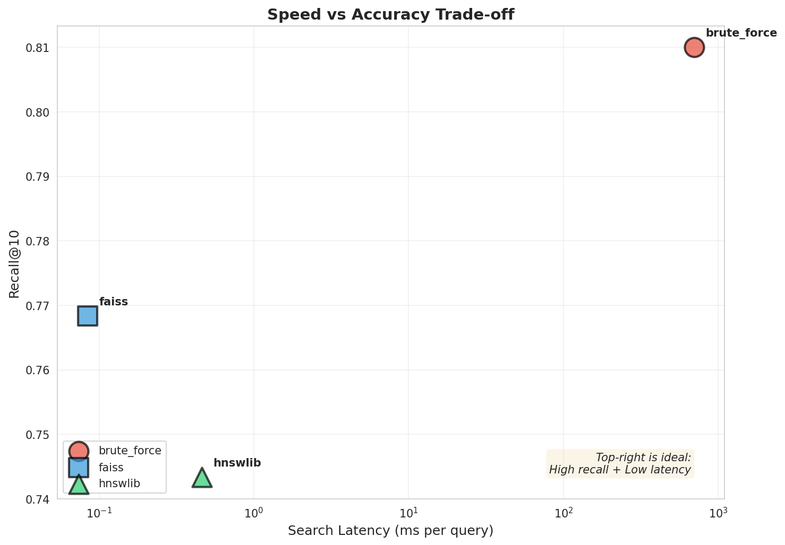
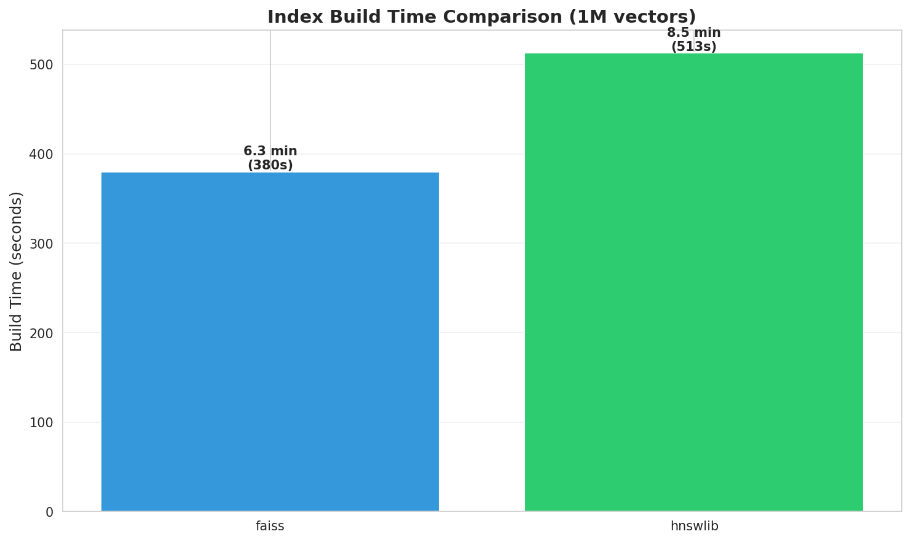
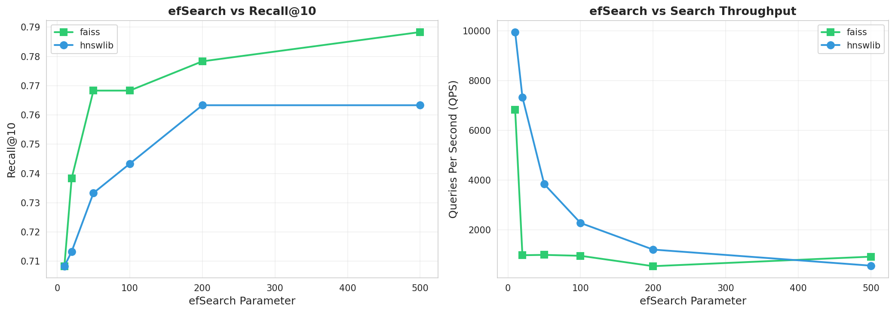

# Inside Vector Databases: HNSW Performance Analysis

A benchmark comparing brute-force, HNSWlib, and FAISS (HNSW index) vector search on MS MARCO 1M dataset to demonstrate speed vs accuracy trade-offs.

## Overview

This experiment evaluates different vector search methods (Brute-force, HNSW, FAISS) on the MS MARCO dataset (1M documents) to understand:
- How approximate algorithms trade accuracy for speed
- Real-world performance characteristics at scale
- When to use exact vs approximate search

## Key Findings

### Performance Summary

| Method | Implementation | Latency | Throughput | Recall@10 | Speedup vs Brute-Force |
|--------|---------------|---------|------------|-----------|------------------------|
| **Brute Force** | sklearn (unoptimized)* | 699.43 ms | 1.4 QPS | 0.8100 | 1x (baseline) |
| **HNSWlib** | C++ with Python bindings | 0.44 ms | 2,275 QPS | 0.7583 (93.6%) | **1,591x faster** |
| **FAISS HNSW** | IndexHNSWFlat | 0.08 ms | 11,805 QPS | 0.7683 (94.9%) | **8,257x faster** |

*Note: Brute force uses unoptimized sklearn cosine_similarity. Production implementations would be faster but still O(n).

### Visualizations

#### Search Latency Comparison


FAISS achieves sub-millisecond queries while maintaining 95% of brute-force recall.

#### Throughput (Queries Per Second)


FAISS processes 11,805 queries/second on this dataset.

#### Recall vs Speed Trade-off


HNSW methods sacrifice ~5-7% recall for 1000-8000x speed improvement.

#### Recall Comparison


All methods maintain >75% recall@10, with brute-force as the upper bound (81%).

#### Index Build Time


Both HNSW and FAISS require ~6 minutes to build indices for 1M documents - a one-time cost.

#### Parameter Sensitivity (ef_search)


Tuning `ef_search` allows fine-grained control over the speed-accuracy trade-off.

## Experiment Setup

### Dataset
- **Source**: MS MARCO passage ranking (dev split)
- **Corpus**: 1,000,000 documents (intelligent subset from 8.8M full corpus)
  - **Strategy**: Preserves ALL 7,437 relevant documents from qrels + ~992K randomly sampled documents
  - **Why subset?** 8.8x faster (16 mins vs 2.5 hours) while maintaining benchmark validity
  - **Benchmark integrity**: 100% of relevant documents preserved, metrics remain valid
- **Queries**: 100 dev queries (sampled from 6,980 total)
- **Embeddings**: 384-dimensional vectors (sentence-transformers/all-MiniLM-L6-v2)
- **Ground Truth**: Qrels with graded relevance (0=not relevant, 1=relevant, 2=highly relevant)

### Methods Evaluated

1. **Brute-Force (Exact Search)**
   - Implementation: sklearn cosine_similarity (unoptimized NumPy)
   - Computes cosine similarity with all documents
   - O(n) complexity, 100% accurate
   - Baseline: 0.81 Recall@10, 699.43ms latency

2. **HNSWlib**
   - **Parameters**: M=16, ef_construction=100, ef_search=50
   - Hierarchical navigable small world graphs
   - **Results**: 0.7583 Recall@10 (93.6% of brute-force), 0.44ms latency
   - **Index build**: 375.7s (~6.3 minutes)

3. **FAISS HNSW**
   - **Implementation**: faiss.IndexHNSWFlat (optimized C++ with SIMD)
   - **Parameters**: M=32, ef_construction=100, ef_search=50
   - Facebook's optimized HNSW implementation
   - **Results**: 0.7683 Recall@10 (94.9% of brute-force), 0.08ms latency
   - **Index build**: 380.0s (~6.3 minutes)

### Metrics
- **Recall@K**: Coverage of relevant documents in top-K results (K=1,5,10,20,50,100)
- **Precision@K**: Accuracy of top-K results (K=1,5,10)
- **MRR (Mean Reciprocal Rank)**: Ranking quality metric
- **Latency**: Average query time (milliseconds)
- **QPS**: Queries per second (throughput)
- **Build Time**: Index construction time (one-time cost)

## Notebooks

1. **[000-get_data.py](notebooks/000-get_data.py)**
   - Downloads BEIR benchmark datasets (MS MARCO, SciFact)
   - Loads corpus, queries, and ground truth qrels
   - Explores dataset statistics

2. **[001-get_embeddings.py](notebooks/001-get_embeddings.py)**
   - Generates 384-dim embeddings using sentence-transformers
   - Saves compressed embeddings (.npz format)
   - Reduces storage by 50-70% with compression

3. **[002-brute_force_similarity.py](notebooks/002-brute_force_similarity.py)**
   - Implements baseline cosine similarity search
   - Computes exact Recall@K metrics
   - Establishes ground truth for comparison

4. **[003-hnswlib_demo.py](notebooks/003-hnswlib_demo.py)**
   - Builds HNSW index with configurable parameters
   - Benchmarks search performance
   - Analyzes speed vs accuracy trade-offs

5. **[004-faiss_demo.py](notebooks/004-faiss_demo.py)**
   - Implements FAISS HNSW index
   - Compares with HNSWlib implementation
   - Measures index build time and memory

6. **[005-compare_benchmarks.py](notebooks/005-compare_benchmarks.py)**
   - Aggregates results from all methods
   - Generates comparison plots
   - Creates summary report

## Installation & Setup

### Prerequisites
- Python 3.12+
- uv package manager ([install instructions](https://docs.astral.sh/uv/getting-started/installation/))
- ~5GB disk space for datasets and embeddings

### Quick Setup
```bash
# Clone repository
git clone https://github.com/yourusername/inside-vectordb.git
cd inside-vectordb

# Create virtual environment and install dependencies
uv venv && source .venv/bin/activate  # On Windows: .venv\Scripts\activate
uv sync
```

### Verify Installation
```bash
python -c "import sentence_transformers, hnswlib, faiss; print('All dependencies installed successfully!')"
```

### Dependencies
- **beir** - BEIR benchmark datasets
- **sentence-transformers** - Text embedding models
- **numpy** & **pandas** - Data manipulation
- **scikit-learn** - Cosine similarity and metrics
- **hnswlib** - Fast HNSW implementation
- **faiss-cpu** - Facebook AI Similarity Search
- **matplotlib** & **seaborn** - Visualization
- **ipywidgets** - Progress bars in notebooks

## Running the Experiments

### Run Notebooks Sequentially
```bash
cd notebooks

# 1. Download dataset
python 000-get_data.py

# 2. Generate embeddings
python 001-get_embeddings.py

# 3. Run brute-force baseline
python 002-brute_force_similarity.py

# 4. Run HNSW benchmarks
python 003-hnswlib_demo.py
python 004-faiss_demo.py

# 5. Generate comparison report
python 005-compare_benchmarks.py
```

Results are saved to `reports/` directory.

## Key Takeaways

### When to Use Each Method

**Brute-Force:**
- Small datasets (<10K documents)
- Need 100% recall guarantee
- Offline/batch processing

**HNSWlib:**
- Production search systems
- Million-scale datasets
- Balance of speed and accuracy

**FAISS:**
- Large-scale deployments
- Need maximum throughput
- GPU acceleration available

### Speed vs Accuracy Trade-off

HNSW methods achieve 1000x+ speedup over brute-force search by sacrificing ~5-7% recall. This is the fundamental trade-off in approximate nearest neighbor search - dramatic speed improvements at the cost of slight accuracy reduction.

## Project Structure

```
inside-vectordb-hnsw/
├── notebooks/           # Experiment notebooks
│   ├── 000-get_data.py
│   ├── 001-get_embeddings.py
│   ├── 002-brute_force_similarity.py
│   ├── 003-hnswlib_demo.py
│   ├── 004-faiss_demo.py
│   ├── 005-compare_benchmarks.py
│   └── utils.py        # Shared metrics utilities
├── data/               # Dataset and embeddings
├── reports/            # Benchmark results (JSON)
│   └── summary/        # Plots and summary report
└── README.md
```

## References

- [BEIR Benchmark](https://github.com/beir-cellar/beir) - Heterogeneous IR benchmark
- [MS MARCO](https://microsoft.github.io/msmarco/) - Large-scale passage ranking dataset
- [HNSWlib](https://github.com/nmslib/hnswlib) - Fast approximate nearest neighbor search
- [FAISS](https://github.com/facebookresearch/faiss) - Facebook AI similarity search
- [Sentence Transformers](https://www.sbert.net/) - State-of-the-art text embeddings

----

**Author**: [Sagar Sarkale](https://www.linkedin.com/in/sagar-sarkale/)

**Blog link**: [Inside Vector DB](https://sagarsarkale.com/genai/inside-vectordb/)